# System Architecture Overview

## Table of Contents

- [System Context](#system-context)
- [Core Architecture](#core-architecture)
- [Component Overview](#component-overview)
- [Data Flow](#data-flow)
- [Communication Patterns](#communication-patterns)
- [Deployment Architecture](#deployment-architecture)
- [Security Architecture](#security-architecture)
- [Performance Considerations](#performance-considerations)

## System Context

The AI Orchestrator Hub is a sophisticated multiagent orchestration system designed to coordinate intelligent agents in a swarm-based architecture. The system operates in a "CPU-native, GPU-optional" paradigm, providing maximum intelligence on minimal hardware while scaling to utilize advanced resources when available.

### External Interfaces

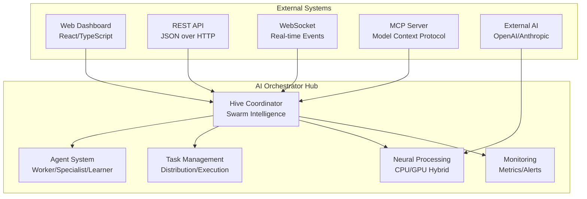

## Core Architecture

### Architectural Principles

1. **Modularity**: System divided into focused, independent modules
2. **Scalability**: Horizontal scaling through agent multiplication
3. **Resilience**: Fault tolerance through intelligent fallback mechanisms
4. **Observability**: Comprehensive monitoring and telemetry
5. **Security**: Defense-in-depth security architecture
6. **Performance**: CPU-native with optional GPU acceleration

### System Layers

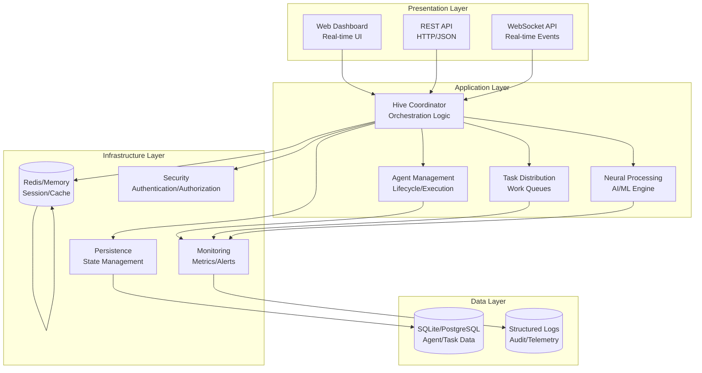

## Component Overview

### Hive Coordinator

**Purpose**: Central orchestration engine managing the entire multiagent system.

**Key Responsibilities**:
- Agent lifecycle management (creation, monitoring, termination)
- Task distribution and load balancing
- Swarm intelligence coordination
- System health monitoring
- Resource allocation and optimization

**Architecture**:
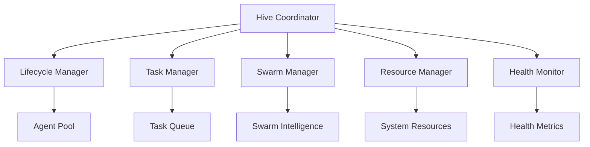

### Agent System

**Purpose**: Manages individual agents with different capabilities and behaviors.

**Agent Types**:
- **Worker**: General-purpose task execution
- **Coordinator**: Leadership and orchestration
- **Specialist**: Domain-specific expertise
- **Learner**: Continuous learning and adaptation

**Architecture**:
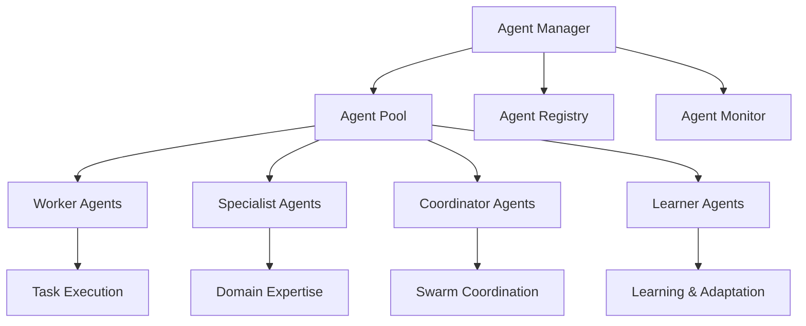

### Task Management

**Purpose**: Handles task creation, queuing, distribution, and execution tracking.

**Key Components**:
- **Task Queue**: Priority-based task queuing
- **Work Stealing**: Load balancing across agents
- **Execution Tracking**: Task lifecycle monitoring
- **Result Handling**: Output processing and validation

**Architecture**:
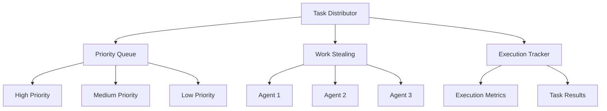

### Neural Processing

**Purpose**: Provides AI/ML capabilities with hybrid CPU/GPU processing.

**Features**:
- **Basic NLP**: Lightweight text processing
- **Advanced Neural**: FANN network integration
- **GPU Acceleration**: CUDA support (optional)
- **Adaptive Learning**: Continuous model improvement

**Architecture**:
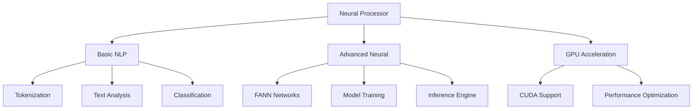

### Communication System

**Purpose**: Handles inter-agent and external communication.

**Protocols**:
- **WebSocket**: Real-time bidirectional communication
- **MCP**: Model Context Protocol for AI integration
- **REST API**: Standard HTTP-based communication
- **Message Passing**: Internal async communication

**Architecture**:
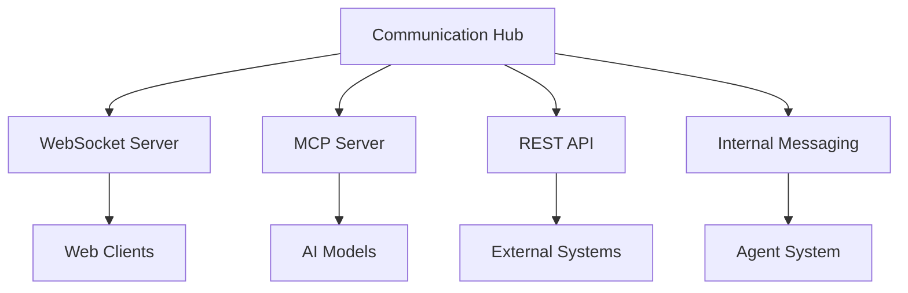

## Data Flow

### Task Execution Flow

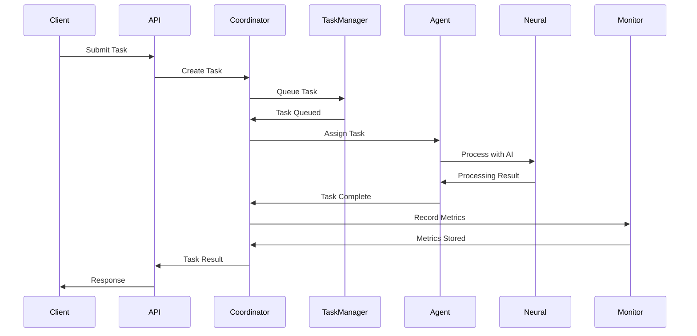

### Agent Lifecycle Flow

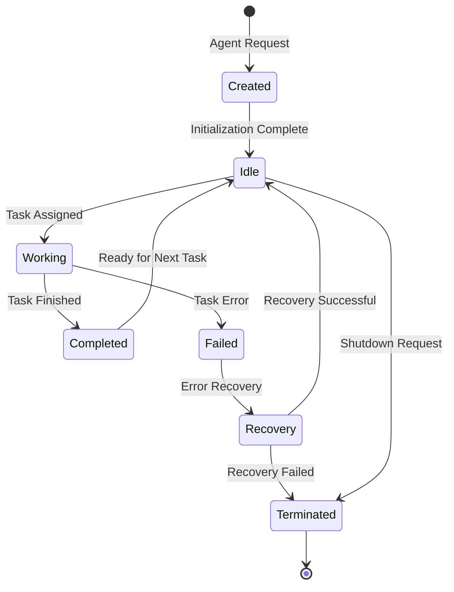

### Real-time Communication Flow

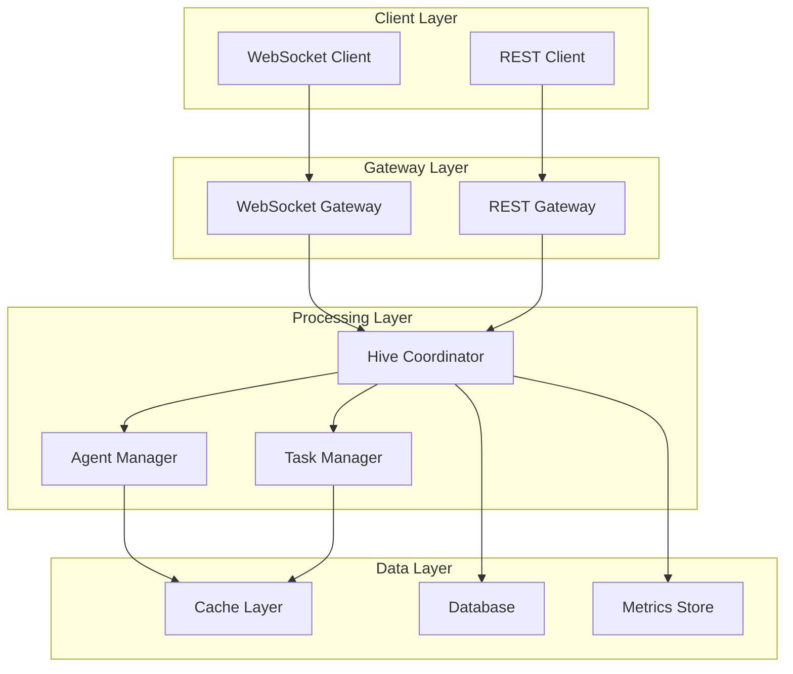

## Communication Patterns

### Synchronous Communication

- **REST API**: Request-response pattern for external clients
- **Direct Method Calls**: Internal synchronous operations
- **Database Queries**: Synchronous data access

### Asynchronous Communication

- **WebSocket Events**: Real-time bidirectional communication
- **Message Passing**: Internal async channels between components
- **Event Streaming**: Publish-subscribe pattern for system events

### Message Patterns

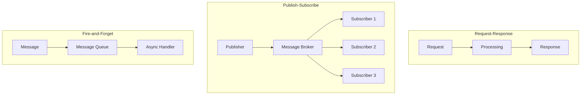

## Deployment Architecture

### Single Node Deployment

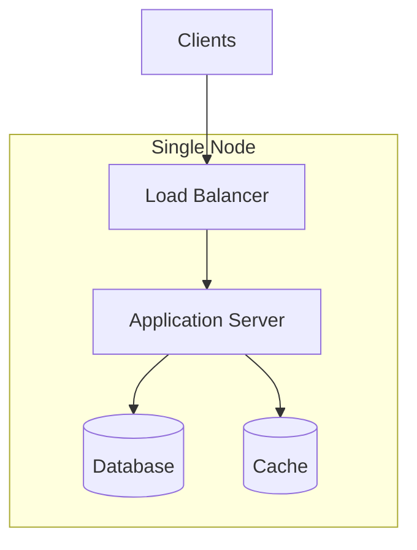

### Multi-Node Deployment

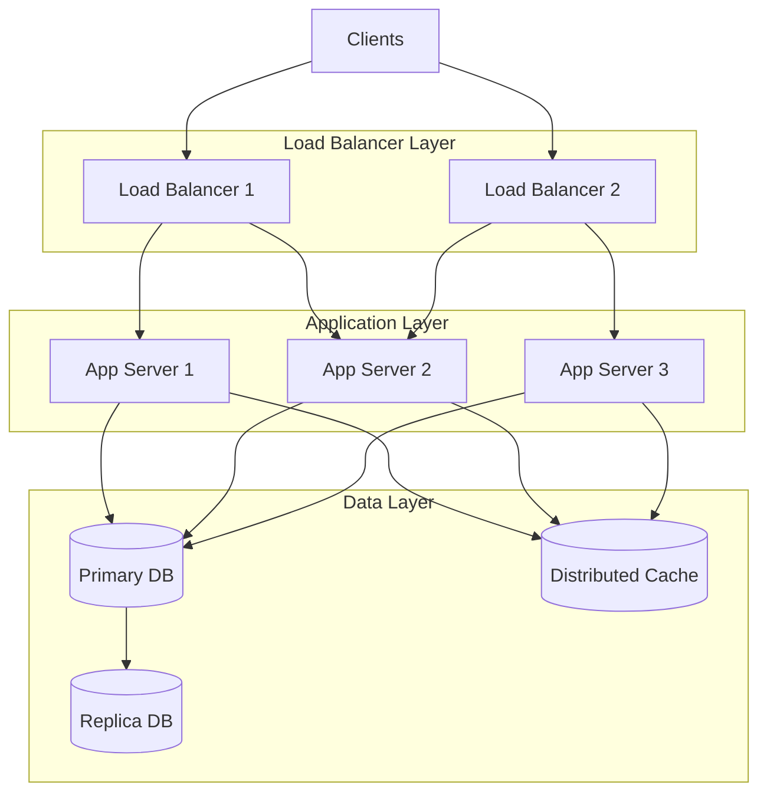

### Kubernetes Deployment

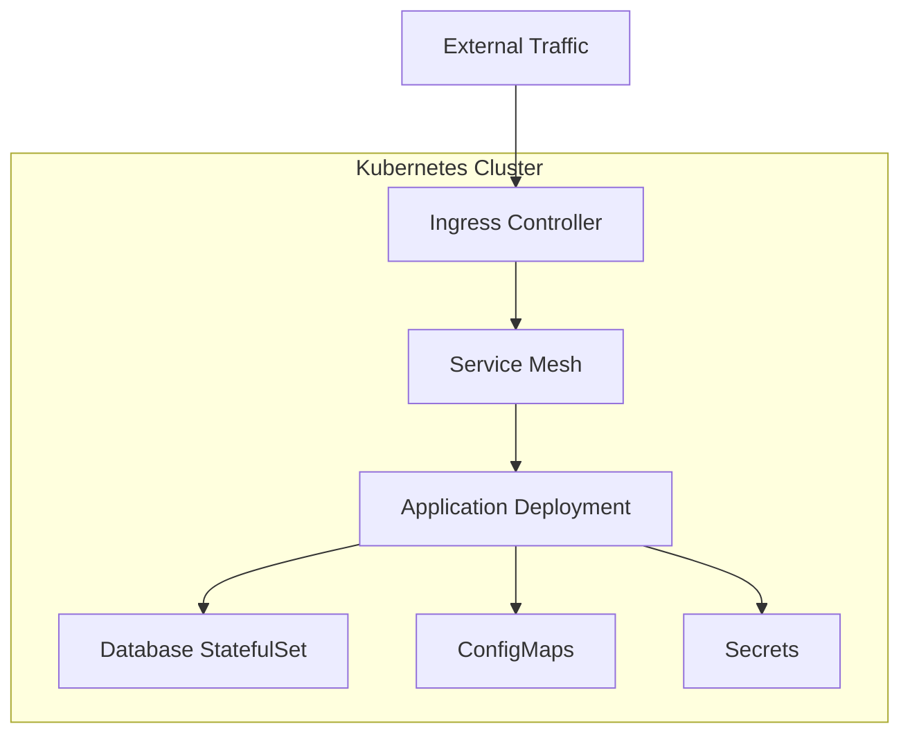

## Security Architecture

### Defense in Depth

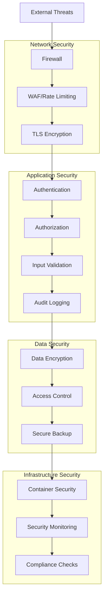

### Security Components

- **Authentication**: JWT-based authentication with configurable secrets
- **Authorization**: Role-based access control for different operations
- **Input Validation**: Comprehensive validation using the validator crate
- **Rate Limiting**: Protection against abuse with configurable limits
- **Audit Logging**: Security event logging with structured format
- **Encryption**: Data encryption at rest and in transit
- **CORS**: Configurable cross-origin resource sharing

## Performance Considerations

### Optimization Strategies

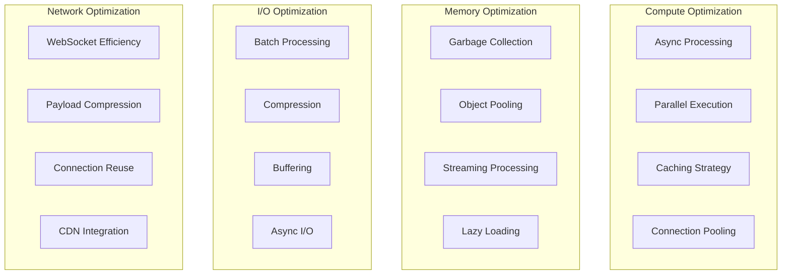

### Performance Metrics

- **Response Time**: API response times under 100ms for 95th percentile
- **Throughput**: 1000+ tasks per second with proper scaling
- **Memory Usage**: Under 512MB for basic operations, 2GB for advanced neural
- **CPU Usage**: Efficient CPU utilization with GPU offloading when available
- **Concurrent Users**: Support for 1000+ concurrent WebSocket connections
- **Database Performance**: Query response times under 10ms

### Scaling Considerations

- **Horizontal Scaling**: Add more application instances
- **Vertical Scaling**: Increase resources per instance
- **Database Scaling**: Read replicas and sharding
- **Cache Scaling**: Distributed caching with Redis Cluster
- **Load Balancing**: Intelligent load distribution based on agent capabilities

## Monitoring and Observability

### Metrics Collection

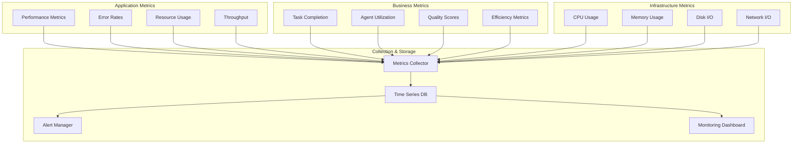

### Alerting Strategy

- **Critical Alerts**: System down, data loss, security breaches
- **Warning Alerts**: High resource usage, performance degradation
- **Info Alerts**: Configuration changes, maintenance notifications
- **Recovery Alerts**: System recovery, service restoration

### Logging Strategy

- **Structured Logging**: JSON format with consistent fields
- **Log Levels**: ERROR, WARN, INFO, DEBUG, TRACE
- **Context Propagation**: Request IDs and correlation IDs
- **Security Events**: Dedicated security logging
- **Performance Logs**: Timing and resource usage information

This architecture overview provides a comprehensive understanding of the AI Orchestrator Hub's design principles, component interactions, and operational characteristics. The modular, scalable architecture supports the system's goals of providing intelligent multiagent orchestration with maximum efficiency and reliability.

---

**Note**: This document should be moved to `docs/architecture/OVERVIEW.md` for proper organization.
