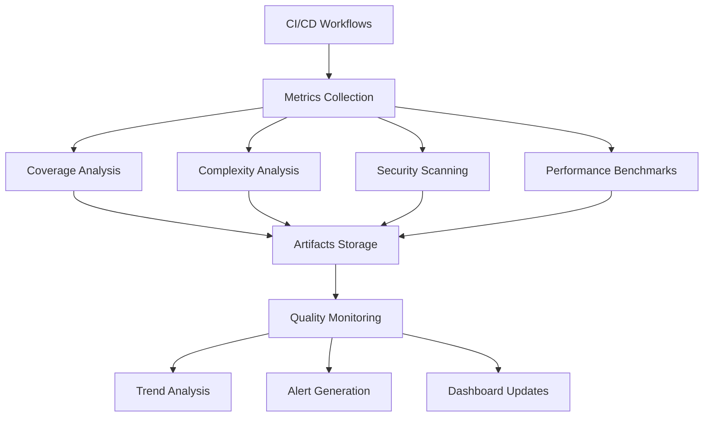

# Code Quality Metrics

This document describes the comprehensive code quality metrics system implemented for the AI Orchestrator Hub project.

## Overview

The quality metrics system provides automated monitoring, analysis, and reporting of code quality across multiple dimensions:

- **Code Coverage**: Test coverage for Rust and TypeScript code
- **Complexity Analysis**: Cyclomatic complexity measurements
- **Performance Benchmarks**: Automated performance regression testing
- **Security Scanning**: Vulnerability detection and tracking
- **Quality Gates**: Automated thresholds and blocking criteria

## Architecture

### CI/CD Integration

Quality metrics are collected through enhanced GitHub Actions workflows:

- `lint.yml`: Code quality checks (linting, coverage, complexity)
- `security.yml`: Security scanning and vulnerability assessment
- `build.yml`: Build verification with coverage reporting
- `quality-monitoring.yml`: Trend analysis and alerting

### Metrics Collection



## Quality Metrics

### Code Coverage

**TypeScript Coverage:**
- Minimum threshold: 80%
- Target: 90%
- Tool: Vitest with @vitest/coverage-v8

**Rust Coverage:**
- Minimum threshold: 75%
- Target: 85%
- Tool: cargo-llvm-cov

### Complexity Analysis

**TypeScript Complexity:**
- Maximum per function: 15
- Maximum per file: 50
- High complexity files allowed: 5
- Tool: complexity-report

**Rust Complexity:**
- Maximum per function: 20
- Maximum per file: 60
- High complexity files allowed: 3
- Tool: cargo-cyclomatic-complexity

### Security Metrics

- Maximum vulnerabilities allowed: 0
- Secrets detection: 0 secrets allowed
- Critical security failures block merges: Yes

### Performance Benchmarks

- Regression threshold: 10% degradation allowed
- Benchmark timeout: 300 seconds
- Required benchmarks: 6 minimum
- Tool: Criterion.rs

## Configuration

Quality thresholds and settings are defined in `.github/quality-config.yml`:

```yaml
coverage:
  typescript:
    minimum: 80
    target: 90
  rust:
    minimum: 75
    target: 85

complexity:
  typescript:
    maximum_per_function: 15
    high_complexity_files_allowed: 5
  rust:
    maximum_per_function: 20
    high_complexity_files_allowed: 3

security:
  maximum_vulnerabilities: 0
  maximum_secrets_allowed: 0
```

## Quality Gates

The system implements quality gates that can block merges:

- **Coverage Gate**: Fails if coverage below minimum thresholds
- **Complexity Gate**: Fails if too many high-complexity files
- **Security Gate**: Fails on any vulnerabilities or secrets
- **Performance Gate**: Fails on significant performance regressions

## Monitoring and Alerting

### Automated Alerts

The system generates alerts for:

- Coverage drops below thresholds
- Complexity increases beyond limits
- New security vulnerabilities
- Performance regressions
- Frequent workflow failures

### Trend Analysis

Historical metrics are tracked and analyzed for:

- Coverage trends over time
- Complexity evolution
- Security vulnerability patterns
- Performance stability

### Dashboard

Quality metrics are presented in GitHub Actions summaries with:

- Current status indicators
- Trend visualizations
- Alert notifications
- Improvement recommendations

## Usage

### Running Quality Checks

Quality checks run automatically on:
- Push to main/develop branches
- Pull requests to main/develop
- Weekly scheduled runs
- Manual workflow dispatch

### Viewing Results

Results are available in:
- GitHub Actions workflow summaries
- Artifact downloads (JSON reports)
- Trend analysis reports
- Quality dashboard updates

### Processing Metrics Locally

Use the quality metrics processing script:

```bash
# Process metrics from artifacts
./scripts/process-quality-metrics.sh /path/to/artifacts /path/to/output

# Generate quality report
./scripts/process-quality-metrics.sh . quality-reports
```

## Tools and Dependencies

### Rust Tools
- `cargo-llvm-cov`: Code coverage
- `cargo-cyclomatic-complexity`: Complexity analysis
- `cargo-audit`: Security vulnerability scanning
- `criterion`: Performance benchmarking

### TypeScript Tools
- `@vitest/coverage-v8`: Test coverage
- `complexity-report`: Complexity analysis
- `audit-ci`: NPM security auditing

### CI/CD Tools
- `codecov/codecov-action`: Coverage reporting
- GitHub Actions artifacts: Metrics storage
- Custom processing scripts: Metrics analysis

## Metrics Storage

Quality metrics are stored as artifacts with:

- **Retention**: 90 days for historical data
- **Format**: JSON for machine processing
- **Location**: GitHub Actions artifacts
- **Backup**: Optional external storage

## Troubleshooting

### Common Issues

**Coverage Not Generated:**
- Ensure test commands include coverage flags
- Check test framework configuration
- Verify artifact upload paths

**Complexity Analysis Fails:**
- Install required tools (`cargo-cyclomatic-complexity`, `complexity-report`)
- Check file permissions
- Verify JSON output formats

**Security Scans Missing:**
- Ensure API keys/tokens are configured
- Check network connectivity to security services
- Verify tool installations

### Debugging

Enable debug logging by setting environment variables:

```bash
export RUST_LOG=debug
export DEBUG=quality-metrics
```

Check workflow logs for detailed error messages and artifact contents.

## Future Enhancements

Planned improvements include:

- **External Dashboard**: Integration with Grafana/Prometheus
- **Advanced Analytics**: Machine learning-based trend prediction
- **Custom Metrics**: Project-specific quality indicators
- **Integration APIs**: Webhooks for external systems
- **Automated Fixes**: AI-powered code improvement suggestions

## Contributing

When adding new quality metrics:

1. Update `.github/quality-config.yml` with new thresholds
2. Add metric collection to appropriate workflow
3. Update processing scripts if needed
4. Add documentation and examples
5. Test with existing CI/CD pipeline

## Support

For issues with quality metrics:

1. Check workflow logs for errors
2. Review artifact contents
3. Run processing scripts locally
4. Check configuration files
5. Create issue with detailed reproduction steps