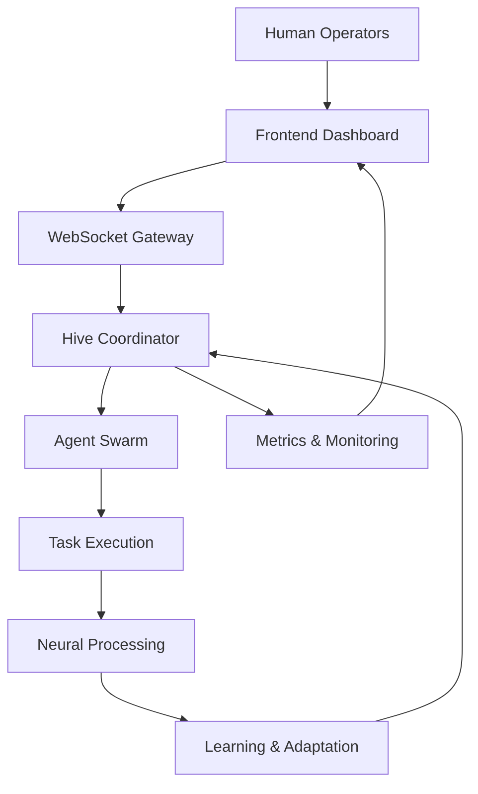
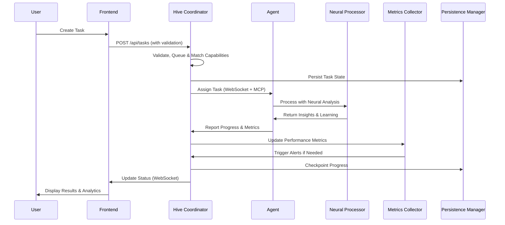
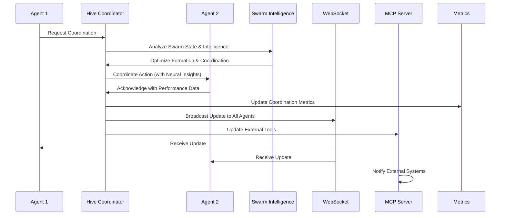

# Architecture Overview

## System Context

The Multiagent Hive System operates as a distributed swarm intelligence platform that combines neural processing, real-time communication, and adaptive learning. It serves as a bridge between human operators and autonomous agent swarms, enabling scalable task execution and collective problem-solving.

## Core Components

### Backend (Rust)

The backend is built with Rust for performance and reliability, providing the core swarm intelligence engine.

#### Main Entry Point (`backend/src/main.rs`)
- **Enhanced Axum Web Server**: HTTP REST API, WebSocket, and MCP support
- **Advanced Middleware**: Security headers, rate limiting, CORS, circuit breaker
- **Background Tasks**: Monitoring, alerting, recovery, and optimization
- **Configuration Management**: Layered config with validation
- **Graceful Shutdown**: Comprehensive cleanup with persistence

#### Hive Coordinator (`backend/src/core/hive.rs`)
- **Swarm Intelligence Engine**: Advanced coordination algorithms
- **Auto-scaling**: Dynamic agent pool management
- **Performance Optimization**: Real-time tuning and resource allocation
- **State Persistence**: Checkpointing and recovery capabilities
- **Intelligent Task Distribution**: ML-enhanced agent assignment

#### Agent System (`backend/src/agents/`)
- **Agent Evolution**: Adaptive capability development and learning
- **Recovery Manager**: Automatic failure detection and recovery
- **Social Intelligence**: Agent relationships and collaborative learning
- **Memory Systems**: Persistent and adaptive agent memory
- **Verification Engine**: Quality assurance and validation
- **Skill Evolution**: Dynamic capability enhancement

#### Task Management (`backend/src/tasks/`)
- **Work Stealing Queue**: Efficient load balancing across agents
- **Priority Scheduling**: Advanced task prioritization with dependencies
- **Progress Tracking**: Comprehensive execution monitoring and metrics
- **Failure Recovery**: Intelligent retry and alternative assignment
- **Batch Processing**: Efficient handling of large task volumes

#### Communication Layer (`backend/src/communication/`)
- **WebSocket Gateway**: Real-time bidirectional communication with heartbeat
- **MCP Protocol Server**: Model Context Protocol implementation
- **Message Routing**: Intelligent message delivery and filtering
- **Connection Pooling**: Efficient client connection management
- **Protocol Extensions**: Custom protocol support for specialized agents

#### Neural Processing (`backend/src/neural/`)
- **Adaptive Learning System**: Continuous improvement through experience
- **CPU Optimization**: SIMD-accelerated neural processing
- **FANN Integration**: Advanced neural networks for complex tasks
- **NLP Engine**: Natural language processing for agent communication
- **Pattern Recognition**: Learning from execution patterns and outcomes

#### Infrastructure (`backend/src/infrastructure/`)
- **Intelligent Alerting**: Predictive analytics and adaptive thresholds
- **Metrics Collector**: Comprehensive performance monitoring
- **Persistence Manager**: State management with backup and recovery
- **Circuit Breaker**: Fault tolerance and graceful degradation
- **Resource Manager**: Dynamic resource allocation and optimization
- **Security Middleware**: Authentication, authorization, and auditing
- **Performance Optimizer**: Auto-tuning and bottleneck detection
- **Memory Pool**: Efficient memory management and pooling
- **Telemetry System**: Advanced observability and tracing

### Frontend (TypeScript/React/Next.js)

The frontend provides a modern web interface for monitoring and controlling the agent swarm.

#### Dashboard (`frontend/src/app/`)
- **Real-time Visualization**: Live swarm status with 3D agent positioning
- **Metrics Display**: Advanced analytics with predictive insights
- **Task Management**: Comprehensive task lifecycle management
- **Agent Control**: Full agent configuration and monitoring
- **Resource Monitoring**: System resource utilization tracking

#### Components (`frontend/src/components/`)
- **HiveDashboard**: Main monitoring interface with intelligent alerts
- **SwarmVisualization**: Interactive 3D swarm representation
- **MetricsPanel**: Advanced performance metrics and trend analysis
- **NeuralMetrics**: Neural processing performance visualization
- **ResourceMonitor**: System resource utilization and optimization
- **AgentManager**: Agent creation, configuration, and lifecycle management
- **TaskManager**: Task queue management with priority scheduling
- **AlertPanel**: Intelligent alerting with predictive capabilities

#### State Management (`frontend/src/store/`)
- **Zustand Store**: Centralized state management with persistence
- **Real-time Updates**: Automatic UI updates from WebSocket events
- **Optimistic Updates**: Immediate UI feedback with conflict resolution
- **Offline Support**: Local state persistence and synchronization

## Data Flow

### Task Execution Flow

### Agent Coordination Flow

## Key Design Decisions

### CPU-Native, GPU-Optional Architecture
- **Primary**: CPU-optimized for accessibility and cost-effectiveness
- **Secondary**: GPU acceleration for performance-critical workloads
- **Rationale**: Maximizes reach while enabling high-performance use cases

### Hybrid Neural Processing
- **Basic Mode**: Lightweight NLP for real-time coordination
- **Advanced Mode**: FANN neural networks for complex pattern recognition
- **Rationale**: Balances performance, resource usage, and capability

### WebSocket-First Communication
- **Real-time**: Immediate updates for dynamic swarm behavior
- **Bidirectional**: Server can push updates to clients
- **Efficient**: Reduces polling overhead and improves responsiveness

### Modular Agent System
- **Capability-Based**: Agents defined by skills rather than fixed roles
- **Dynamic Assignment**: Tasks matched to best available agents
- **Scalable**: Easy addition of new agent types and capabilities

## Technology Choices

### Backend
- **Rust**: Memory safety, zero-cost abstractions, high performance
- **Axum**: Modern async web framework with tower middleware
- **Tokio**: Async runtime with work-stealing scheduler
- **Serde**: Efficient serialization with custom derives
- **rusqlite**: Embedded database with advanced features
- **Tower**: Modular middleware for security, rate limiting, CORS
- **Tracing**: Structured logging and telemetry
- **Anyhow**: Ergonomic error handling
- **DashMap**: Concurrent hash maps for shared state
- **Petgraph**: Graph algorithms for swarm intelligence

### Frontend
- **Next.js 15**: Full-stack React framework with App Router
- **TypeScript**: Strict type checking and advanced types
- **Tailwind CSS**: Utility-first styling with custom design system
- **Zustand**: Lightweight state management with persistence
- **Recharts**: Declarative data visualization
- **Lucide React**: Consistent icon system
- **AI SDK**: OpenAI and Anthropic integration

### Neural Processing
- **Custom NLP**: Lightweight, CPU-optimized natural language processing
- **ruv-FANN**: Fast Artificial Neural Network library
- **Adaptive Learning**: Continuous improvement algorithms
- **SIMD Optimization**: CPU vectorization for performance
- **GPU Support**: Optional CUDA/OpenCL acceleration

### Infrastructure
- **Circuit Breaker**: Fault tolerance and resilience
- **Rate Limiter**: API protection and abuse prevention
- **Security Middleware**: Authentication, authorization, auditing
- **Metrics Collection**: Performance monitoring and alerting
- **Persistence Layer**: State management with backup/recovery
- **Resource Optimization**: Dynamic memory and CPU management

## Deployment Architecture

### Development
- **Single Machine**: Backend and frontend on localhost
- **Hot Reload**: Fast development iteration
- **In-memory Storage**: Quick setup and teardown

### Production
- **Containerized**: Docker with multi-stage builds for optimization
- **Orchestrated**: Kubernetes with Helm charts for deployment
- **Load Balanced**: Multiple backend instances with session affinity
- **Persistent Storage**: PostgreSQL/MySQL with connection pooling
- **Service Mesh**: Istio for advanced traffic management
- **Ingress**: NGINX/Traefik for routing and SSL termination

### Cloud Deployment
- **Serverless**: API Gateway + Lambda for cost-effective scaling
- **CDN**: CloudFront/Cloudflare for global asset delivery
- **Managed Database**: RDS/Aurora with automated backups
- **Monitoring**: CloudWatch/DataDog for comprehensive observability
- **Security**: WAF, security groups, and IAM roles
- **Auto-scaling**: EC2 Auto Scaling Groups or Fargate

### Edge Deployment
- **CDN Functions**: Cloudflare Workers for global distribution
- **Edge Computing**: Deploy agents on edge devices
- **Hybrid Cloud**: Combination of cloud and on-premises
- **Multi-region**: Active-active deployment across regions

## Security Considerations

### Authentication & Authorization
- **JWT Tokens**: Stateless authentication with configurable expiration
- **API Keys**: Secure programmatic access with rotation
- **Role-Based Access Control**: Granular permissions and policies
- **MCP Authentication**: Protocol-level security for external tools
- **Session Management**: Secure session handling with timeouts

### Data Protection
- **Transport Encryption**: TLS 1.3 for all communications
- **Data Encryption**: AES-256-GCM for data at rest
- **Input Validation**: Comprehensive validation with security auditing
- **Rate Limiting**: Configurable limits with burst handling
- **Data Sanitization**: XSS and injection prevention

### Network Security
- **CORS**: Strict origin validation with credentials support
- **WebSocket Security**: Origin validation, authentication, and encryption
- **Firewall**: Network segmentation and access control
- **DDoS Protection**: Rate limiting and traffic analysis
- **Certificate Management**: Automated SSL certificate rotation

### Application Security
- **Security Headers**: Comprehensive HTTP security headers
- **CSRF Protection**: Cross-site request forgery prevention
- **Content Security Policy**: XSS prevention and script control
- **Security Auditing**: Comprehensive audit trails and monitoring
- **Vulnerability Scanning**: Automated security scanning and updates

## Performance Characteristics

### Scalability
- **Horizontal**: Add more agents for increased capacity
- **Vertical**: Utilize more powerful hardware
- **Elastic**: Auto-scaling based on load

### Resource Usage
- **Memory**: 256MB-2.5GB depending on configuration and load
- **CPU**: 1-16 cores with SIMD optimization for neural processing
- **Network**: Low bandwidth for coordination, scalable for high-throughput
- **Storage**: 1GB-10GB+ for persistence, metrics, and logs
- **GPU**: Optional CUDA/OpenCL support for neural acceleration

### Performance Benchmarks
- **Task Throughput**: 50-1000+ tasks/second based on configuration
- **Agent Coordination**: Sub-millisecond response times
- **Neural Processing**: 15-50ms for analysis, faster with GPU
- **API Latency**: <10ms for simple operations, <100ms for complex
- **WebSocket Throughput**: 1000+ concurrent connections
- **Database Performance**: 1000+ operations/second with pooling

### Scalability Metrics
- **Horizontal Scaling**: Linear performance scaling with agent count
- **Vertical Scaling**: Efficient resource utilization up to 16+ cores
- **Memory Efficiency**: ~50KB per agent with optimized data structures
- **Network Efficiency**: Compressed WebSocket messages and batching
- **Storage Efficiency**: Compressed persistence with incremental backups

## Monitoring & Observability

### Metrics Collection
- **System Metrics**: CPU, memory, disk, network utilization
- **Application Metrics**: Task completion rates, agent performance, API latency
- **Business Metrics**: Swarm cohesion, learning progress, prediction accuracy
- **Custom Metrics**: Domain-specific KPIs and performance indicators
- **Real-time Analytics**: Live metrics with trend analysis

### Intelligent Alerting
- **Predictive Alerts**: ML-based anomaly detection and forecasting
- **Adaptive Thresholds**: Dynamic alert levels based on historical data
- **Multi-channel Notifications**: Email, Slack, webhooks, console
- **Alert Correlation**: Grouping related alerts and reducing noise
- **Auto-resolution**: Automatic alert clearing based on system recovery

### Logging & Tracing
- **Structured Logging**: JSON format with consistent schema
- **Log Levels**: TRACE, DEBUG, INFO, WARN, ERROR with filtering
- **Distributed Tracing**: End-to-end request tracking with correlation IDs
- **Performance Profiling**: Detailed execution timing and bottleneck analysis
- **Security Event Logging**: Audit trails for security-relevant events

### Observability Features
- **Health Checks**: Comprehensive system health monitoring
- **Dependency Monitoring**: External service health and performance
- **Custom Dashboards**: Configurable monitoring views
- **Historical Analysis**: Long-term trend analysis and reporting
- **Integration APIs**: Third-party monitoring tool integration

## Future Evolution

### Current Advanced Features
- **AI Integration**: OpenAI, Anthropic SDK integration
- **MCP Protocol**: Model Context Protocol for external tool support
- **Advanced Neural Networks**: FANN-based processing with GPU acceleration
- **Intelligent Alerting**: Predictive analytics and adaptive monitoring
- **Enterprise Persistence**: PostgreSQL/MySQL with advanced features

### Planned Enhancements
- **Multi-Region Deployment**: Global distribution with data synchronization
- **Federated Learning**: Distributed learning across multiple hives
- **Edge Computing**: Agent deployment on IoT and edge devices
- **Advanced AI Models**: Integration with latest LLM architectures
- **Quantum Computing**: Hybrid classical-quantum processing

### Extensibility Points
- **Plugin Architecture**: Custom agent types, neural networks, and protocols
- **API Extensions**: REST, GraphQL, and custom protocol support
- **Storage Backends**: PostgreSQL, MySQL, MongoDB, Redis integration
- **Visualization Engine**: Custom dashboard components and themes
- **Integration Framework**: Webhooks, message queues, and external APIs
- **Security Modules**: Custom authentication and authorization providers